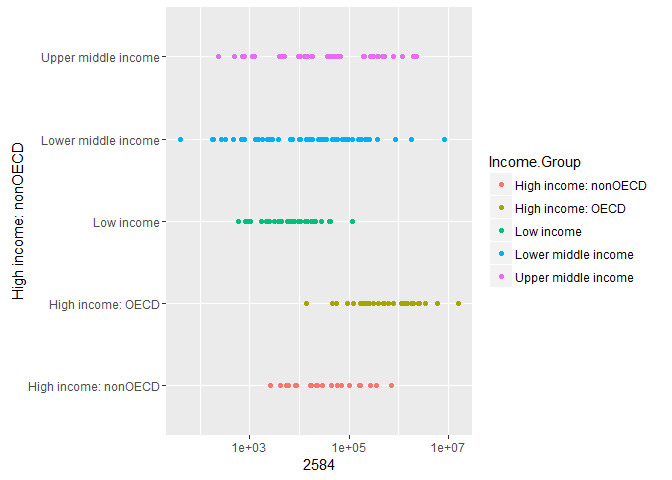

# Case Study - GDP data
Nimish Sakalle  
October 30, 2016  


<br>

### **CaseStudy - Introduction**

This document is a detail case study of GDP and Education data file from world bank for the top 190 economies of the world.
The data for the case study is downloaded from worldbank website. 
 
  http://data.worldbank.org/data-catalog/GDP-ranking-table
  http://data.worldbank.org/data-catalog/ed-stats

First file GDP.csv has ranking of the countries based on the GDP (Gross Domenstic Product) and second file is detail file with lots of other information about that country (like currency units, groups, debt information etc.)

The objective of this case study is to merge both the files, make the data consistent (including cleanup) and analize data for countries and their GDP group and plot for visual review.

This analysis is done in R (R is a language and environment for statistical computing and graphics).

###**Making environment ready**


###** Getting Gather, Merge and Tidy file **


```
## 
## > library(plyr)
## 
## > library(ggplot2)
## 
## > setwd("C:\\RProject\\CaseStudy_fall2016\\Data")
## 
## > GDP <- read.csv("GDP.csv", skip = 3, header = TRUE)
## 
## > GDP_RAW <- GDP
## 
## > FEDSTATS <- read.csv("EDSTATS.csv", header = TRUE)
## 
## > FEDSTATS_Raw <- FEDSTATS
```

```
## 
## > colnames(GDP)[1] <- "CountryCode"
## 
## > colnames(GDP)[5] <- "GDP"
## 
## > GDP.Final <- GDP[, c(1:2, 4:5)]
## 
## > GDP.Final.Clean <- GDP.Final[!(is.na(GDP.Final$Ranking)), 
## +     ]
## 
## > Final.GDP <- GDP.Final.Clean[!(is.na(GDP.Final.Clean$GDP)), 
## +     ]
## 
## > nrow(Final.GDP)
## [1] 237
```

```
## 
## > Merge.Data <- merge(Final.GDP, FEDSTATS, BY = "CountryCode")
## 
## > Merge.GDP.STAT <- Merge.Data[, c(1, 2, 3, 4, 6)]
## 
## > dim(Merge.GDP.STAT)
## [1] 224   5
## 
## > GDP.STAT.MATCH <- nrow(Merge.GDP.STAT)
## 
## > GDP.STAT.MATCH
## [1] 224
## 
## > print(paste0("IDs Matched:", GDP.STAT.MATCH))
## [1] "IDs Matched:224"
```

###**Seting up project directory path.**

**Data Gathering - File read and visual inspection**


```
## [1] "X"           "Ranking"     "X.1"         "Economy"     "US.dollars."
## [6] "X.2"
```

```
## [1] 234
```

###**Tidy Data**

 Data quality is most important aspect of any sort of data analysis.
 Below are steps to make sure data is cleaned up for good anaylsis. Its important to review data before and after data cleanup.
 

```
## [1] 237
```

```
## [1] 190
```
The above show the numbers of rows in the data frame before and after cleanup.

###**Data Merge and Analysis 1**

*Data Merge using country code from both the files.*
*verify Numbers of Ids matched from both the files.*

To continue with the analysis, in the following steps data from GDP and Education file is merged on country code.
After merging both the file, its important to visually inspect data to make sure data does not have any more anomalies.


```
## [1] "CountryCode"  "Ranking"      "Economy"      "GDP"         
## [5] "Income.Group"
```

```
## [1] 189   5
```

```
## [1] "IDs Matched:189"
```

#####Number of ID matched 189


###**Data Sort and Analysis 2**

To sort the data on GDP in assending order and publish the coutry stand 13 on the list.

     CountryCode    Ranking  Economy                GDP  Income.Group        
---  ------------  --------  --------------------  ----  --------------------
93   KNA                178  St. Kitts and Nevis    767  Upper middle income 


###**Analysis 3: AVG GDP Ranking **

Getting a mean of ranking based on the income group.


Income.Group              Ranking
---------------------  ----------
High income: nonOECD     91.91304
High income: OECD        32.96667
Low income              133.72973
Lower middle income     107.70370
Upper middle income      92.13333

The mean Ranking of high Income OECD and Non OECD group is:

|Income.Group         |   Ranking|
|:--------------------|---------:|
|High income: nonOECD |  91.91304|
|High income: OECD    |  32.96667|

###**Analysis 4** 

To generate a plot to see GDP on scale based on the income group.

<!-- -->


This plot shows GDP number (Log-scale 10) of the countries based on the income group. This graphs clearly show the mean GDP of income group with  Highincome OECD and High Income Non OECD is significantly higher than other income groups.

###**Analysis 5**

To cut the countries into 5 quantil for each income group and see the data distribution.


|                     | (0.811,38.8]| (38.8,76.6]| (76.6,114]| (114,152]| (152,190]|
|:--------------------|------------:|-----------:|----------:|---------:|---------:|
|                     |            0|           0|          0|         0|         0|
|High income: nonOECD |            4|           5|          8|         4|         2|
|High income: OECD    |           18|          10|          1|         1|         0|
|Low income           |            0|           1|          9|        16|        11|
|Lower middle income  |            5|          13|         12|         8|        16|
|Upper middle income  |           11|           9|          8|         8|         9|


The above are number of countiries belongs ito each income group divided into five quantiles. This data clearly show GPD of the counties is distributed, even that are part of any particular income group.  


|    |CountryCode | Ranking|Economy          |     GDP|Income.Group        |Quantile     |
|:---|:-----------|-------:|:----------------|-------:|:-------------------|:------------|
|34  |CHN         |       2|China            | 8227103|Lower middle income |(0.811,38.8] |
|51  |EGY         |      38|Egypt, Arab Rep. |  262832|Lower middle income |(0.811,38.8] |
|77  |IDN         |      16|Indonesia        |  878043|Lower middle income |(0.811,38.8] |
|78  |IND         |      10|India            | 1841710|Lower middle income |(0.811,38.8] |
|165 |THA         |      31|Thailand         |  365966|Lower middle income |(0.811,38.8] |

*The above 5 Lower income countries belowgs amongst 38 nations with highest GDP.

### **CaseStudy - Conclusion**

This objective of this case study is to perform key steps that requires in any data analysis.
These keys steps are very foundation of any project where it requires to read, study, interpret and process information.
We performed foundation step like data gathering, data cleaning, data merging, data analysis and data processing on data GDP and Education data from world bank.
One more very important step (making reproducable research and data) is been accompleshed inthis case study, by making data and research available at GitHub.
All the above steps are performend in R using R studio.

By looking at the data and graphs it is very clear that GDP of some of the courtries are different than their income group.
SOme of the contries belong to low income group have high GDP and vice versa.

###EOF


